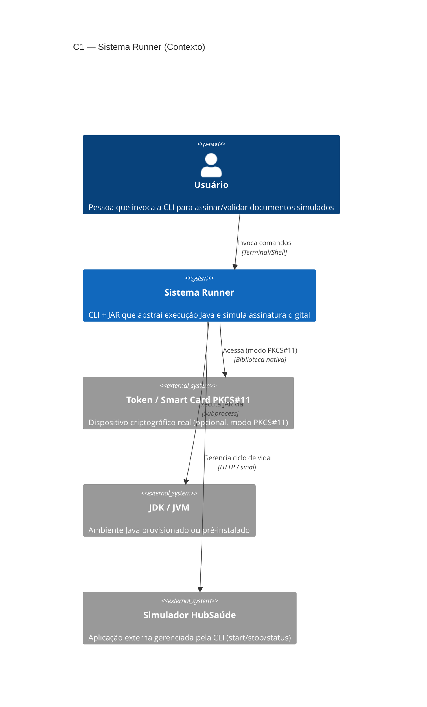

# Diagramas C4 — Sistema Runner

> **Documento:** Diagramas arquiteturais (modelo C4)
> **Projeto:** Sistema Runner — CLI + JAR de assinatura simulada
> **Última atualização:** 2026-07-02

Este documento contém os 4 níveis do modelo C4 aplicados ao Sistema Runner.
A fonte é Mermaid (renderiza direto no GitHub, GitLab, VS Code).

**Convenções:**

- Caixas com `[]` representam sistemas externos.
- Caixas com `()` representam containers/processos do nosso sistema.
- Setas sólidas (`-->`) = chamadas síncronas. Setas tracejadas (`-->` com `--` ASCII) = assíncronas ou arquivos.
- Decisões citadas (ex.: ADR-001) referenciam `docs/adr/`.

---

## C1 — Diagrama de Contexto

Mostra o Sistema Runner como uma caixa-preta no centro, os atores que o
usam e os sistemas externos com os quais ele troca dados.

**Atores / sistemas:**

| Elemento | Tipo | Relação com o Runner |
|---|---|---|
| Usuário | Humano | Invoca `assinatura ...` no shell |
| JDK/JVM | Sistema externo (dependência) | Hospeda o `assinador.jar` |
| Token PKCS#11 | Sistema externo (opcional) | Usado quando modo PKCS#11 ativo |
| Simulador HubSaúde | Sistema externo (parceria) | Ciclo de vida controlado pela CLI |

---

