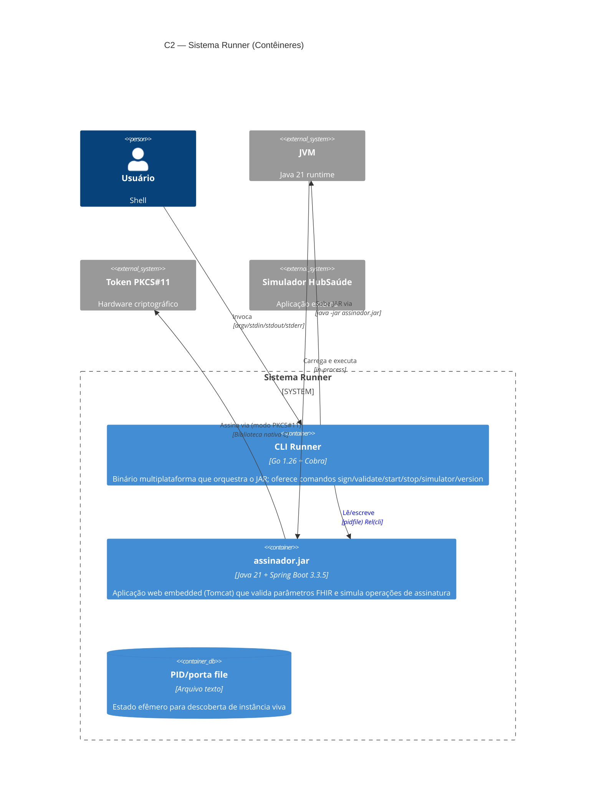

# Diagramas C4 — Sistema Runner

> **Documento:** Diagramas arquiteturais (modelo C4)
> **Projeto:** Sistema Runner — CLI + JAR de assinatura simulada
> **Última atualização:** 2026-07-02

Este documento contém os 4 níveis do modelo C4 aplicados ao Sistema Runner.
A fonte é Mermaid (renderiza direto no GitHub, GitLab, VS Code).

**Convenções:**

- Caixas com `[]` representam sistemas externos.
- Caixas com `()` representam containers/processos do nosso sistema.
- Setas sólidas (`-->`) = chamadas síncronas. Setas tracejadas (`-->` com `--` ASCII) = assíncronas ou arquivos.
- Decisões citadas (ex.: ADR-001) referenciam `docs/adr/`.

---

## C2 — Diagrama de Contêineres

Zoom no Runner: separa os processos executáveis e como se conversam.

**Containers:**

| Container | Tecnologia | Responsabilidade |
|---|---|---|
| **CLI Runner** | Go 1.26 + Cobra | Interface com usuário; orquestração; ciclo de vida; provisionamento JDK |
| **assinador.jar** | Java 21 + Spring Boot 3.3.5 | Validação de entrada (autoridade única — ver ADR-004); simulação de assinatura; exposição HTTP |
| **PID/porta file** | Arquivo texto | Estado para descoberta de instância viva (ver ADR-003) |

**Decisões refletidas neste nível:**

- Porta padrão 8080, configurável via `--port` (ADR-001).
- Modo servidor como default (ADR-002).
- Descoberta de instância viva via TCP + health check (ADR-003).

---

