# Diagramas C4 — Sistema Runner

> **Documento:** Diagramas arquiteturais (modelo C4)
> **Projeto:** Sistema Runner — CLI + JAR de assinatura simulada
> **Última atualização:** 2026-07-02

Este documento contém os 4 níveis do modelo C4 aplicados ao Sistema Runner.
A fonte é Mermaid (renderiza direto no GitHub, GitLab, VS Code).

**Convenções:**

- Caixas com `[]` representam sistemas externos.
- Caixas com `()` representam containers/processos do nosso sistema.
- Setas sólidas (`-->`) = chamadas síncronas. Setas tracejadas (`-->` com `--` ASCII) = assíncronas ou arquivos.
- Decisões citadas (ex.: ADR-001) referenciam `docs/adr/`.

---

## C3 — Componentes do `assinador.jar`

Zoom dentro do JAR: pacotes, controllers, use cases, serviços de domínio.

```mermaid
C4Component
    title C3 — assinador.jar (Componentes)

    Container_Boundary(jar, "assinador.jar") {
        Component(app, "AssinadorApplication", "Java + Spring Boot", "Entry point: parse de args, configura server.port, inicia Spring")
        Component(web, "WebApplication", "Java + @SpringBootApplication", "Bootstrap Spring + scan de componentes")

        Component(healthCtrl, "HealthController", "@RestController", "GET /health → {status:UP}")
        Component(sigCtrl, "SignatureController", "@RestController", "POST /sign, POST /validate; converte DTO ↔ domain")
        Component(excHandler, "GlobalExceptionHandler", "@ControllerAdvice", "Mapeia ValidationException → 400 com JSON estruturado")

        Component(signUC, "SignUseCase", "@Service / @Component", "Orquestra fluxo de assinatura")
        Component(valUC, "ValidateUseCase", "@Service / @Component", "Orquestra fluxo de validação")
        Component(validator, "RequestValidator", "@Component", "Regras de validação (autoridade única — ADR-004)")
        Component(valExc, "ValidationException", "RuntimeException", "Erro de validação do usuário (≠ erro de sistema)")

        Component(fakeSvc, "FakeSignatureService", "@Component (default)", "Simulação pura — sem dependência externa")
        Component(pkcs11Svc, "Pkcs11SignatureService", "@Component (perfil PKCS#11)", "Assina via token real via PKCS#11")
        Component(pkcs11Factory, "Pkcs11ServiceFactory", "@Component", "Seleciona implementação baseada em config")
        Component(pkcs11Cfg, "Pkcs11Config", "@ConfigurationProperties", "Configuração PKCS#11 (path, slot, pin)")

        Component(json, "JsonMapper", "@Component", "Serialização Jackson customizada")
        Component(inact, "InactivityShutdown", "@Component", "Thread watchdog que encerra o JAR por inatividade")
        Component(inactFlt, "InactivityFilter", "OncePerRequestFilter", "Marca timestamp a cada requisição")
        Component(ts, "RequestTimestamp", "@Component (AtomicLong)", "Último instante de atividade")
        Component(startup, "ServerStartupHandler", "ApplicationListener", "Escreve PID/port file; loga startup")
    }

    Rel(app, web, "Delega para")
    Rel(web, healthCtrl, "Scan e registra")
    Rel(web, sigCtrl, "Scan e registra")
    Rel(sigCtrl, signUC, "Invoca")
    Rel(sigCtrl, valUC, "Invoca")
    Rel(sigCtrl, excHandler, "Exceções caem em")
    Rel(signUC, validator, "Valida entrada")
    Rel(valUC, validator, "Valida entrada")
    Rel(validator, valExc, "Lança em erro de regra")
    Rel(signUC, fakeSvc, "Default")
    Rel(signUC, pkcs11Svc, "Quando perfil PKCS#11")
    Rel(pkcs11Svc, pkcs11Factory, "Obtém via")
    Rel(pkcs11Factory, pkcs11Cfg, "Lê config")
    Rel(healthCtrl, json, "Resposta")
    Rel(sigCtrl, json, "Resposta")
    Rel(inact, ts, "Lê último timestamp")
    Rel(inactFlt, ts, "Atualiza a cada request")
    Rel(startup, app, "Dispara ao subir")
```

**Componentes por camada:**

| Camada | Componentes |
|---|---|
| **Bootstrap** | `AssinadorApplication`, `WebApplication`, `ServerStartupHandler` |
| **Presentation (HTTP)** | `HealthController`, `SignatureController`, `GlobalExceptionHandler`, DTOs HTTP |
| **Application (use cases)** | `SignUseCase`, `ValidateUseCase`, `RequestValidator`, `ValidationException` |
| **Domain** | `FakeSignatureService`, `Pkcs11SignatureService` (interfaces e impls) |
| **Infrastructure** | `Pkcs11Config`, `Pkcs11ServiceFactory`, `JsonMapper`, `InactivityShutdown`, `InactivityFilter`, `RequestTimestamp` |

**Decisões refletidas neste nível:**

- Validação no JAR (autoridade única) — ADR-004.
- Auto-shutdown por inatividade — ADR-005.
- Health check como contrato de descoberta — ADR-003.

---

